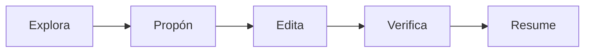
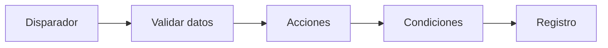

# Programación con Inteligencia Artificial

## Para profesionales clínicos

David Guallar · Alejandro Venegas  
Zaragoza

<div class="pt-10 opacity-70">
De una necesidad clínica a un prototipo funcional
</div>

<!--
Abrir con una idea tranquila: no venimos a convertir médicos en programadores profesionales, sino a enseñarles a dirigir IA para crear soluciones digitales pequeñas, seguras y bien planteadas.
-->

---

# Punto de partida

La mayoría de médicos no necesita empezar memorizando sintaxis.

Necesita aprender a:

- Formular problemas clínicos como tareas digitales.
- Dar contexto y límites a una IA.
- Revisar resultados con criterio.
- Separar prototipo docente de herramienta asistencial.

---

# Objetivo de la clase

Al final de la sesión, el alumno debería poder:

- Entender qué papel juega la IA en programación.
- Reconocer las piezas básicas de un proyecto.
- Pedir cambios a un agente de forma segura.
- Diseñar un prototipo con datos ficticios.
- Identificar riesgos clínicos, técnicos y de privacidad.

---

# Idea central

La IA no elimina la necesidad de pensar bien.

La aumenta.

<div class="pt-8 text-left max-w-3xl mx-auto">

Cuanto mejor definido esté el problema, mejor será la respuesta de la IA.

</div>

---

# Mapa de la clase

1. Fundamentos y entorno.
2. Agentes IA y conectividad.
3. Proyectos prácticos.
4. Automatización y otros usos.

---
layout: section
---

# 1. Fundamentos y entorno

---

# El cambio importante

Petición débil:

> "Hazme una aplicación para gestionar pacientes."

Petición útil:

> "Quiero un prototipo educativo con pacientes ficticios, un formulario, una tabla de resultados y exportación. No debe usar datos reales. Propón una arquitectura sencilla y dime qué habría que validar antes de usarlo en entorno real."

---

# Qué hace bien la IA

- Ordenar ideas iniciales.
- Convertir protocolos en pasos lógicos.
- Crear especificaciones funcionales.
- Comparar tecnologías.
- Generar datos ficticios.
- Crear prototipos rápidos.
- Documentar y explicar.
- Proponer pruebas y casos límite.

---

# Qué no debemos delegar ciegamente

- Reglas clínicas no validadas.
- Cálculos médicos sin comprobar.
- Recomendaciones terapéuticas automatizadas.
- Procesamiento de datos reales sin garantías.
- Arquitecturas con información sensible sin control.
- Código sin revisión técnica.

La responsabilidad clínica no desaparece.

---

# Conceptos base del curso

| Concepto | Traducción práctica |
|----------|---------------------|
| LLM | Modelo de lenguaje grande, como ChatGPT, Claude o Gemini |
| Prompt | Instrucción que damos al modelo |
| Token | Unidad mínima de texto que procesa el modelo |
| Ventana de contexto | Memoria activa disponible durante una sesión |

<small>Las diferencias prácticas entre modelos se explican mejor con ejemplos y demostración, no como tabla exhaustiva.</small>

---

# Qué es un lenguaje de programación

Un lenguaje de programación permite expresar instrucciones que ejecuta un ordenador.

Para entendernos:

- Es un idioma formal que el ordenador puede interpretar.
- Cada lenguaje tiene ventajas, límites y ecosistema propio.
- La IA ayuda a escribirlo, pero conviene saber qué piezas está tocando.
- Para ejecutar código suele hacer falta instalar el lenguaje o sus paquetes.

---

# IDE: el Word para programar

Un IDE permite crear, modificar y organizar software.

Puede incluir:

- Explorador de archivos.
- Autocompletado.
- Detección de errores.
- Terminal integrada.
- Control de versiones.
- Ayuda de IA sobre el proyecto.

Sí, se puede programar en un bloc de notas. Pero para aprender y revisar, un IDE da mucho más contexto.

---

# Git y GitHub

**Git** trabaja en local y guarda el historial de cambios del proyecto.

**GitHub** es un repositorio online donde se pueden publicar proyectos públicos o privados.

En la práctica sirven para:

- Recuperar versiones anteriores.
- Revisar qué ha cambiado.
- Colaborar con otras personas.
- Pedir revisión antes de mezclar cambios.
- Enseñar a la IA el estado real de un proyecto.

---

# Vibe coding

Programar con IA a través de instrucciones en lenguaje natural.

Hay varios niveles:

1. Artifacts o pequeñas apps dentro del chat.
2. Archivo único generado por IA y ejecutado localmente.
3. IDEs agénticos con poco contacto directo con el código.
4. IDEs con IA como Cursor, Windsurf o Antigravity IDE.
5. Agentes por terminal o CLI, como Claude Code o Codex.

Cuanto más poder damos al agente, más importante es revisar.

---

# Chatbots y agentes

**Chatbot**

- Recibe un prompt.
- Responde texto, código o explicación.
- Normalmente no actúa sobre el proyecto por sí mismo.

**Agente**

- Lee archivos.
- Usa herramientas.
- Puede ejecutar comandos.
- Propone y aplica cambios.
- Verifica y resume el resultado.

Un IDE con IA se acerca más a un agente que a un chat convencional.

---

# Arquitectura muy básica

| Capa | Qué significa |
|------|---------------|
| Frontend | Lo que ve y usa la persona |
| Backend | La lógica principal del programa |
| Base de datos | Donde se guarda información persistente |

No todos los programas necesitan base de datos.

Para una demo docente, a veces basta con un archivo CSV, JSON o datos ficticios en memoria.

---

# MCP, skills y extensiones

Los modelos generan texto. Las herramientas les permiten actuar.

| Elemento | Idea principal |
|----------|----------------|
| MCP | Protocolo para conectar modelos con herramientas y contexto |
| Skill | Instrucciones especializadas para una tarea concreta |
| Extensión | Integración que conecta el entorno con otras capacidades |

Más integración significa más superficie de riesgo: archivos, comandos, internet, secretos y datos sensibles.

---

# Lenguajes habituales

| Lenguaje | Uso frecuente |
|----------|---------------|
| Python | Scripts, datos, automatización y prototipos |
| HTML | Estructura básica de páginas web |
| JavaScript | Frontend web y también backend con Node.js |
| Java | Software empresarial y proyectos muy estructurados |

Para pequeños ejecutables, Python suele ser una buena primera opción.

Antes de publicar en una intranet, hay que conocer frontend, backend, servidor y versiones permitidas.

---

# Ecosistema de herramientas

| Tipo | Para qué sirve |
|------|----------------|
| ChatGPT, Claude, Gemini | Preguntar, resumir, razonar, generar textos |
| Cursor, Windsurf, VS Code | Editar proyectos con ayuda de IA |
| Codex, Claude Code, agentes | Trabajar con varios archivos y pasos |
| Colab, Jupyter | Datos, scripts, experimentos |
| Make, n8n | Automatizaciones no-code |

<small>Docs: [OpenAI Codex](https://platform.openai.com/docs/codex) · [Claude Code](https://docs.claude.com/en/docs/claude-code/overview) · [Jupyter](https://docs.jupyter.org/en) · [n8n](https://docs.n8n.io/)</small>

---

# Lenguajes útiles

**Python**

- Automatización.
- Datos.
- Notebooks.
- Prototipos científicos.

**JavaScript / TypeScript**

- Aplicaciones web.
- Interfaces interactivas.
- Proyectos profesionales de frontend.

---

# IDE: el taller de trabajo

Un IDE es un entorno para leer, escribir y organizar código.

Ejemplos:

- Visual Studio Code.
- Cursor.
- Windsurf.
- Antigravity.

La clave no es saber todo el IDE. Es saber abrir una carpeta, dar contexto a la IA y revisar cambios.

---

# Médico Dev Starter Pack

No hace falta instalarlo todo al principio.

## Nivel 0: imprescindible

- Navegador.
- VS Code o Windsurf.
- Git.
- Node.js.
- Python.
- Una IA de apoyo.

Con esto ya se puede empezar.

<small>Docs: [VS Code](https://code.visualstudio.com/docs) · [Windsurf](https://docs.windsurf.com/) · [Git](https://git-scm.com/book/en/v2) · [Node.js](https://nodejs.org/docs/latest/api/) · [Python](https://docs.python.org/3/)</small>

---

# Segunda fase

## Cuando ya han hecho 1-2 proyectos

- GitHub.
- pip o uv.
- Jupyter o Google Colab.
- Streamlit.
- Un agente de programación integrado.

Este nivel permite prototipos más útiles sin saturar la primera sesión.

<small>Docs: [GitHub](https://docs.github.com/) · [pip](https://pip.pypa.io/en/stable/) · [uv](https://docs.astral.sh/uv/) · [Jupyter](https://docs.jupyter.org/en) · [Streamlit](https://docs.streamlit.io/)</small>

---

# Herramientas avanzadas

No son requisito inicial:

- Docker.
- GitHub CLI.
- nvm, pnpm, yarn.
- Netlify o Railway CLI.
- Mermaid CLI.
- Codex CLI, Claude Code, Gemini CLI.
- MCP y skills avanzadas.
- n8n o Make.

Llegan cuando el problema lo justifica.

<small>Docs: [Docker](https://docs.docker.com/get-started/) · [GitHub CLI](https://cli.github.com/manual/) · [nvm-windows](https://github.com/coreybutler/nvm-windows) · [Mermaid](https://mermaid.js.org/intro/) · [Make](https://www.make.com/en/help) · [n8n](https://docs.n8n.io/)</small>

---

<style>
.download-card {
  border-bottom: 0 !important;
  color: inherit !important;
  text-decoration: none !important;
}
.download-card span {
  border-bottom: 0 !important;
  color: #555;
  text-decoration: none !important;
  word-break: break-word;
}
</style>

# Descargas: base mínima

Capturas tomadas el 23/05/2026 desde páginas oficiales.

<div class="grid grid-cols-3 gap-3 mt-3 text-[10px] leading-tight">
  <a href="https://code.visualstudio.com/download" target="_blank" class="download-card block text-inherit no-underline">
    
    <strong>VS Code</strong><br /><span>https://code.visualstudio.com/download</span>
  </a>
  <a href="https://windsurf.com/download" target="_blank" class="download-card block text-inherit no-underline">
    
    <strong>Windsurf</strong><br /><span>https://windsurf.com/download</span>
  </a>
  <a href="https://git-scm.com/downloads" target="_blank" class="download-card block text-inherit no-underline">
    
    <strong>Git</strong><br /><span>https://git-scm.com/downloads</span>
  </a>
  <a href="https://nodejs.org/en/download" target="_blank" class="download-card block text-inherit no-underline">
    
    <strong>Node.js</strong><br /><span>https://nodejs.org/en/download</span>
  </a>
  <a href="https://www.python.org/downloads/" target="_blank" class="download-card block text-inherit no-underline">
    
    <strong>Python</strong><br /><span>https://www.python.org/downloads/</span>
  </a>
  <div class="text-sm leading-snug opacity-80 pt-4">
    Para la primera sesión: editor, Git, Node.js y Python. <br />
    `npm` viene con Node.js. `pip` viene con Python.
  </div>
</div>

---

# Acceso web: sin instalar

Estas herramientas se usan desde el navegador. No hay que buscar instalador.

<div class="grid grid-cols-3 gap-3 mt-3 text-[10px] leading-tight">
  <a href="https://chatgpt.com/" target="_blank" class="download-card block text-inherit no-underline">
    
    <strong>ChatGPT</strong><br /><span>https://chatgpt.com/</span>
  </a>
  <a href="https://claude.ai/" target="_blank" class="download-card block text-inherit no-underline">
    
    <strong>Claude</strong><br /><span>https://claude.ai/</span>
  </a>
  <a href="https://gemini.google.com/" target="_blank" class="download-card block text-inherit no-underline">
    
    <strong>Gemini</strong><br /><span>https://gemini.google.com/</span>
  </a>
  <a href="https://github.com/" target="_blank" class="download-card block text-inherit no-underline">
    
    <strong>GitHub</strong><br /><span>https://github.com/</span>
  </a>
  <a href="https://colab.research.google.com/" target="_blank" class="download-card block text-inherit no-underline">
    
    <strong>Google Colab</strong><br /><span>https://colab.research.google.com/</span>
  </a>
  <div class="text-sm leading-snug opacity-80 pt-4">
    Útil para empezar sin preparar un entorno local complejo.
  </div>
</div>

---

# Editores y agentes

Herramientas para trabajar sobre carpetas de código con ayuda de IA.

<div class="grid grid-cols-3 gap-3 mt-3 text-[10px] leading-tight">
  <a href="https://cursor.com/download" target="_blank" class="download-card block text-inherit no-underline">
    
    <strong>Cursor</strong><br /><span>https://cursor.com/download</span>
  </a>
  <a href="https://antigravity.google/download" target="_blank" class="download-card block text-inherit no-underline">
    
    <strong>Antigravity</strong><br /><span>https://antigravity.google/download</span>
  </a>
  <a href="https://openai.com/codex/" target="_blank" class="download-card block text-inherit no-underline">
    
    <strong>Codex</strong><br /><span>https://openai.com/codex/</span>
  </a>
  <a href="https://docs.anthropic.com/en/docs/claude-code/setup" target="_blank" class="download-card block text-inherit no-underline">
    
    <strong>Claude Code</strong><br /><span>docs.anthropic.com/.../claude-code/setup</span>
  </a>
  <a href="https://github.com/google-gemini/gemini-cli/blob/main/docs/get-started/index.md" target="_blank" class="download-card block text-inherit no-underline">
    
    <strong>Gemini CLI</strong><br /><span>github.com/google-gemini/gemini-cli</span>
  </a>
  <a href="https://cli.github.com/" target="_blank" class="download-card block text-inherit no-underline">
    
    <strong>GitHub CLI</strong><br /><span>https://cli.github.com/</span>
  </a>
</div>

---

# Datos, prototipos y entorno

Herramientas habituales cuando el alumno empieza a trabajar con datos o apps pequeñas.

<div class="grid grid-cols-3 gap-3 mt-3 text-[10px] leading-tight">
  <a href="https://jupyter.org/install" target="_blank" class="download-card block text-inherit no-underline">
    
    <strong>Jupyter</strong><br /><span>https://jupyter.org/install</span>
  </a>
  <a href="https://docs.astral.sh/uv/getting-started/installation/" target="_blank" class="download-card block text-inherit no-underline">
    
    <strong>uv</strong><br /><span>docs.astral.sh/uv/.../installation</span>
  </a>
  <a href="https://docs.streamlit.io/get-started/installation" target="_blank" class="download-card block text-inherit no-underline">
    
    <strong>Streamlit</strong><br /><span>docs.streamlit.io/get-started/installation</span>
  </a>
  <a href="https://www.docker.com/products/docker-desktop/" target="_blank" class="download-card block text-inherit no-underline">
    
    <strong>Docker Desktop</strong><br /><span>docker.com/products/docker-desktop/</span>
  </a>
  <a href="https://github.com/coreybutler/nvm-windows/releases/latest" target="_blank" class="download-card block text-inherit no-underline">
    
    <strong>nvm-windows</strong><br /><span>github.com/coreybutler/nvm-windows/releases</span>
  </a>
  <a href="https://es.sli.dev/guide/install.html" target="_blank" class="download-card block text-inherit no-underline">
    
    <strong>Slidev</strong><br /><span>https://es.sli.dev/guide/install.html</span>
  </a>
</div>

---

# CLI opcionales

Se instalan desde terminal. No son necesarios para la primera práctica.

<div class="grid grid-cols-3 gap-3 mt-3 text-[10px] leading-tight">
  <a href="https://pnpm.io/installation" target="_blank" class="download-card block text-inherit no-underline">
    
    <strong>pnpm</strong><br /><span>https://pnpm.io/installation</span>
  </a>
  <a href="https://yarnpkg.com/getting-started/install" target="_blank" class="download-card block text-inherit no-underline">
    
    <strong>Yarn</strong><br /><span>https://yarnpkg.com/getting-started/install</span>
  </a>
  <a href="https://docs.netlify.com/cli/get-started/" target="_blank" class="download-card block text-inherit no-underline">
    
    <strong>Netlify CLI</strong><br /><span>docs.netlify.com/cli/get-started/</span>
  </a>
  <a href="https://docs.railway.com/guides/cli" target="_blank" class="download-card block text-inherit no-underline">
    
    <strong>Railway CLI</strong><br /><span>https://docs.railway.com/guides/cli</span>
  </a>
  <a href="https://github.com/mermaid-js/mermaid-cli" target="_blank" class="download-card block text-inherit no-underline">
    
    <strong>Mermaid CLI</strong><br /><span>github.com/mermaid-js/mermaid-cli</span>
  </a>
  <div class="text-sm leading-snug opacity-80 pt-4">
    `npm`, `pip` y entornos virtuales se explican como comandos, no como programas aparte.
  </div>
</div>

---

# Automatización no-code

Make es un servicio web. n8n puede usarse en cloud o instalarse/self-host.

<div class="grid grid-cols-2 gap-5 mt-5 text-xs leading-tight">
  <a href="https://www.make.com/en/register" target="_blank" class="download-card block text-inherit no-underline">
    
    <strong>Make</strong><br /><span>https://www.make.com/en/register</span>
  </a>
  <a href="https://docs.n8n.io/hosting/installation/docker/" target="_blank" class="download-card block text-inherit no-underline">
    
    <strong>n8n</strong><br /><span>docs.n8n.io/hosting/installation/docker/</span>
  </a>
</div>

---

# Este repositorio

| Archivo | Función |
|---------|---------|
| `slides.md` | Presentación en Slidev |
| `teoria.md` | Documento teórico maestro |
| `index.md` | Temario resumido |
| `package.json` | Comandos y dependencias |
| `dist/` | Presentación construida |

Un proyecto no es un archivo suelto: es una carpeta organizada.

<small>Docs: [Slidev](https://sli.dev/) · [npm package.json](https://docs.npmjs.com/cli/v11/configuring-npm/package-json)</small>

---

# Entornos aislados

Cada proyecto debe vivir en su propia carpeta, con:

- Sus dependencias.
- Su historial Git.
- Sus instrucciones.
- Sus datos ficticios.
- Sus variables de entorno.

Objetivo: que un proyecto no rompa otro.

---

# Aislar por repositorio

Ejemplo:

```text
proyectos/
  curso-IA-programacion/
  calculadora-riesgo-docente/
  analisis-actividad-quirofano/
  automatizacion-inscripciones/
```

Si cambia el objetivo, los datos o las dependencias, suele convenir otro repositorio.

<small>Docs: [Git basics](https://git-scm.com/book/en/v2/Getting-Started-Git-Basics) · [GitHub repositories](https://docs.github.com/en/repositories/creating-and-managing-repositories/about-repositories)</small>

---

# Dependencias por proyecto

**Node.js**

- `package.json` declara librerías.
- `node_modules/` contiene dependencias instaladas.

**Python**

- `.venv/` aísla librerías.
- `requirements.txt` permite reproducirlas.

No se mezclan librerías de varios prototipos en la misma carpeta.

<small>Docs: [npm install](https://docs.npmjs.com/cli/v11/commands/npm-install) · [Python venv](https://docs.python.org/3/library/venv.html) · [pip requirements](https://pip.pypa.io/en/stable/user_guide/#requirements-files)</small>

---

# Secretos y variables

Algunas configuraciones no deben ir en el código:

- Claves de API.
- Contraseñas.
- Tokens.
- URLs privadas.

Se suelen guardar en `.env` y excluir con `.gitignore`.

Para clase: usar ejemplos simulados, no claves reales.

<small>Docs: [gitignore](https://git-scm.com/docs/gitignore) · [GitHub secret scanning](https://docs.github.com/en/code-security/secret-scanning/introduction/about-secret-scanning)</small>

---

# Terminal sin miedo

Comandos que conviene reconocer:

```bash
npm install
npm run build
git status
git add .
git commit -m "Describe el cambio"
```

La terminal no es magia: es una forma precisa de pedir tareas al ordenador.

---

# Glosario de supervivencia

| Concepto | Traducción práctica |
|----------|---------------------|
| Frontend | Lo que ve el usuario |
| Backend | Lógica y datos detrás |
| API | Puente entre sistemas |
| Base de datos | Lugar estructurado para guardar información |
| Deploy | Publicar una aplicación |
| Test | Prueba para comprobar que algo funciona |
| PR | Cambio propuesto antes de mezclarlo |

<small>Docs: [Git book](https://git-scm.com/book/en/v2) · [GitHub pull requests](https://docs.github.com/en/pull-requests)</small>

---

# IA revisando PRs

La IA puede actuar como revisor adicional:

- Codex: `@codex review` en GitHub.
- Claude: `@claude` o GitHub Actions.
- Puede detectar bugs, regresiones y riesgos.
- No sustituye revisión humana ni validación clínica.

Útil cuando el alumno ya entiende GitHub y ramas.

<small>Docs: [Codex GitHub integration](https://developers.openai.com/codex/integrations/github) · [Codex GitHub Action](https://developers.openai.com/codex/github-action) · [Claude Code GitHub Actions](https://docs.claude.com/en/docs/claude-code/github-actions)</small>

---

# Datos estructurados

Una aplicación entiende mejor datos estructurados que texto libre.

```json
{
  "edad": 72,
  "asa": 3,
  "hemoglobina": 10.8,
  "cirugia": "protesis de rodilla"
}
```

Para clase: datos ficticios, no identificables.

---

# Mini-lección: Markdown

Markdown es una forma sencilla de escribir texto con estructura.

No es programar.

Es escribir documentos que entienden bien:

- Una persona pueda leerlo.
- Git pueda guardar cambios.
- GitHub pueda mostrarlo bonito.
- Un agente de IA pueda entender contexto.

Ejemplos del curso:

`README.md` · `slides.md` · `teoria.md`

---

# Por qué le gusta a la IA

Un agente trabaja mejor si el contexto está ordenado.

Markdown permite separar:

- Objetivo.
- Contexto.
- Datos.
- Restricciones.
- Riesgos.
- Criterios de aceptación.
- Pasos de verificación.

Un `.md` bien escrito evita conversaciones largas y confusas.

---

# Markdown como historia clínica

Pensad en Markdown como la historia clínica del proyecto.

Debe dejar claro:

- Motivo de consulta: qué problema queremos resolver.
- Antecedentes: contexto y restricciones.
- Exploración: archivos, datos y flujo actual.
- Plan: cambios pedidos.
- Evolución: decisiones, pruebas y riesgos.

La IA entiende mejor un caso bien presentado.

---

# Sintaxis mínima

| Quiero escribir | Uso |
|-----------------|-----|
| Título | `# Título` |
| Sección | `## Sección` |
| Lista | `- elemento` |
| Pasos | `1. paso` |
| Negrita | `**importante**` |
| Código o campo | `` `edad` `` |
| Enlace | `[texto](https://...)` |
| Tarea | `- [ ] revisar` |

Con esto ya se puede documentar un proyecto.

---

# Un encargo en Markdown

```markdown
# Encargo

Crear un prototipo educativo para consulta preoperatoria.

## Restricciones

- Usar solo datos ficticios.
- No guardar información identificable.
- Mantenerlo simple para médicos no técnicos.

## Resultado esperado

- Formulario.
- Tabla resumen.
- Riesgos y criterios de aceptación.
```

---

# Antes y después

Petición débil:

> "Hazme una app para pacientes."

Petición con Markdown:

```markdown
# Objetivo
Prototipo docente con pacientes ficticios.

## Datos
edad, ASA, hemoglobina, tipo de cirugía.

## Riesgos
No usar datos reales. No dar recomendaciones clínicas automáticas.
```

La segunda instrucción da dirección.

---

# Checklist para agentes

Antes de pedir cambios a una IA:

- [ ] ¿He explicado el objetivo?
- [ ] ¿He dicho qué archivos puede tocar?
- [ ] ¿He prohibido datos reales?
- [ ] ¿He definido qué significa "terminado"?
- [ ] ¿He pedido verificación?
- [ ] ¿He pedido resumen de riesgos?

Esto también es Markdown.

---

# Actividad: crear contexto

En parejas, escribid un mini `README.md`:

1. Nombre del prototipo.
2. Problema clínico que simula.
3. Datos ficticios de entrada.
4. Qué debe mostrar.
5. Qué no debe hacer.
6. Riesgos y validaciones.

Después se lo daremos a un agente.

---

# Principios de seguridad

1. Usar datos ficticios o anonimizados.
2. Separar prototipo educativo de uso asistencial.
3. Validar reglas clínicas con fuentes fiables.
4. Revisar cálculos y casos límite.
5. Preferir soluciones simples.
6. Documentar qué hace y qué no hace.
7. Pedir revisión técnica y legal si va a entorno real.

---
layout: section
---

# 2. Agentes IA y conectividad

---

# Qué es un agente de programación

Una IA que puede trabajar sobre un proyecto:

- Leer archivos.
- Proponer cambios.
- Editar código.
- Ejecutar comandos.
- Verificar resultados.
- Resumir riesgos.

El médico no tiene que hacerlo todo, pero sí debe dirigir el encargo.

---

# Antigravity: estado actual

Google Antigravity es una familia de herramientas para trabajar con agentes de programación.

**Última verificación:** 21 mayo 2026.

- Lanzamiento público de Antigravity 2.0, CLI y SDK: 19 mayo 2026.
- Versiones oficiales detectadas: Antigravity 2.0 `2.0.1`; Antigravity IDE `2.0.2`.
- Hay varias superficies: app central, terminal, SDK e IDE.

Para uso clínico: practicar siempre con repositorios docentes y datos ficticios.

<small>Fuente: [Antigravity](https://antigravity.google/) · [Descargas](https://antigravity.google/download) · [Releases](https://antigravity.google/releases)</small>

<!--
Dato verificado el 21/05/2026 en la web oficial y endpoints públicos de releases. La web oficial lista posts fechados el 19/05/2026 para Antigravity 2.0, CLI, SDK y Gemini Enterprise.
-->

---

# Modalidades de Antigravity

| Modalidad | Para qué sirve | Cuándo usarla |
|-----------|----------------|---------------|
| Antigravity 2.0 | Centro de mando con varios agentes locales | Gestionar proyectos y tareas paralelas |
| Antigravity CLI | Agente desde terminal | Trabajar rápido en una carpeta concreta |
| Antigravity SDK | Crear agentes propios en Python | Prototipos, automatización y evaluación |
| Antigravity IDE | Editor completo con agente integrado | Programar con contexto profundo del código |

La elección depende del nivel técnico y del riesgo del proyecto.

<small>Docs: [Product](https://antigravity.google/product) · [Download](https://antigravity.google/download)</small>

---

# Instalar Antigravity 2.0

Aplicación central para gestionar varios agentes, conversaciones, proyectos y espacios de trabajo.

1. Ir a `https://antigravity.google/download`.
2. Descargar según sistema:
   - macOS: Apple Silicon o Intel, archivo `.dmg`.
   - Windows: x64 o ARM64, archivo `.exe`.
   - Linux: x64 o ARM64, archivo `.tar.gz`.
3. Abrir la app e iniciar sesión.

Requisitos oficiales destacados:

- macOS 12 Monterey o superior.
- Windows 10 de 64 bits.
- Linux con `glibc >= 2.28` y `glibcxx >= 3.4.25`.

---

# Instalar Antigravity CLI

La modalidad de terminal: útil cuando ya sabemos movernos por carpetas y comandos.

```bash
# macOS y Linux
curl -fsSL https://antigravity.google/cli/install.sh | bash
```

```powershell
# Windows PowerShell
irm https://antigravity.google/cli/install.ps1 | iex
```

```cmd
:: Windows CMD
curl -fsSL https://antigravity.google/cli/install.cmd -o install.cmd && install.cmd && del install.cmd
```

Hay que autenticarse con Antigravity o Antigravity IDE antes de usar la CLI.

---

# Instalar Antigravity SDK

SDK para crear agentes propios con Python sobre el entorno de Antigravity.

Uso recomendado en este curso:

- Entender qué es un agente programable.
- Probar automatizaciones con datos ficticios.
- Evaluar flujos repetibles sin tocar sistemas clínicos reales.

Instalación:

```bash
git clone https://github.com/google-antigravity/antigravity-sdk-python
cd antigravity-sdk-python
```

Después, seguir el `README` del repositorio oficial para crear el entorno Python.

<small>Repositorio: [google-antigravity/antigravity-sdk-python](https://github.com/google-antigravity/antigravity-sdk-python)</small>

---

# Instalar Antigravity IDE

Editor completo con agente integrado, artefactos y comprensión del repositorio.

1. Ir a `https://antigravity.google/download`.
2. Descargar **Antigravity IDE** según sistema:
   - macOS: `.dmg`.
   - Windows: `.exe`.
   - Linux: `.tar.gz`.
3. Abrir una carpeta de proyecto.
4. Pedir primero una exploración antes de permitir cambios.

Regla docente:

> Antes de editar: "explora el repositorio y dime qué cambiarías".

Así el alumno aprende a dirigir, no solo a aceptar.

---

# Una buena instrucción

Debe incluir:

- Contexto.
- Objetivo.
- Restricciones.
- Criterios de aceptación.
- Forma de entrega.

```text
Soy médico y preparo una clase para residentes.
Modifica solo teoria.md.
Amplía APIs con ejemplos clínicos ficticios.
No uses datos reales.
Resume cambios y riesgos pendientes.
```

---

# Flujo recomendado



Primero entender. Después modificar. Al final comprobar.

---

# Qué revisar siempre

- ¿Ha respetado el objetivo?
- ¿Ha tocado archivos que no debía?
- ¿Ha introducido datos reales?
- ¿Ha inventado normas, herramientas o citas?
- ¿El código se ejecuta?
- ¿La explicación sirve para médicos?
- ¿Las reglas clínicas están validadas?

---

# API: conexión entre sistemas

Una API permite que dos sistemas se comuniquen.

Analogía:

- El médico solicita una prueba.
- El laboratorio recibe una petición estructurada.
- El laboratorio devuelve un resultado estructurado.

En software:

```text
Aplicación -> petición
API        -> respuesta
```

<small>Docs: [MDN HTTP](https://developer.mozilla.org/en-US/docs/Web/HTTP) · [MDN JSON](https://developer.mozilla.org/en-US/docs/Learn_web_development/Core/Scripting/JSON)</small>

---

# Bases de datos

Una base de datos sirve para guardar, buscar y proteger información.

Tiene sentido cuando:

- Hay muchos registros.
- Varias personas usan el sistema.
- Se necesitan permisos.
- Hay que evitar duplicados.
- Hay que registrar cambios.

Para una demo, muchas veces basta con CSV, JSON o datos inventados.

<small>Docs: [PostgreSQL](https://www.postgresql.org/docs/) · [SQLite](https://www.sqlite.org/docs.html)</small>

---

# Tabla ficticia para practicar

| id | edad | asa | tipo_cirugia | hb_preoperatoria |
|---:|-----:|----:|---------------|-----------------:|
| 1 | 68 | 3 | rodilla | 11.2 |
| 2 | 74 | 2 | cadera | 12.9 |
| 3 | 59 | 3 | columna | 10.5 |

Sirve para aprender sin exponer pacientes.

---

# Riesgos al conectar sistemas

- Exposición de datos identificables.
- Accesos no autorizados.
- Errores al transformar datos.
- Información desactualizada.
- Dependencia de servicios externos.
- Automatización de decisiones no validadas.

Cuanto más cerca de datos reales, más revisión.

---

# Skills y MCP

Los modelos generan texto. Las herramientas les dan capacidad de actuar.

**Skill**

Instrucciones especializadas para una tarea.

**MCP**

Protocolo para conectar la IA con archivos, bases de datos o servicios.

Más capacidad exige más control.

<small>Docs: [Model Context Protocol](https://modelcontextprotocol.io/docs) · [Codex docs](https://platform.openai.com/docs/codex)</small>

---

# Preguntas antes de conectar una IA

- ¿Qué datos podrá leer?
- ¿Puede modificar archivos?
- ¿Puede ejecutar comandos?
- ¿Puede acceder a internet?
- ¿Puede ver información sensible?
- ¿Queda registro?
- ¿Quién valida el resultado?

---
layout: section
---

# 3. Proyectos prácticos

---

# Del problema clínico al producto digital

Primero lenguaje clínico:

- ¿Qué problema tengo?
- ¿A quién afecta?
- ¿Cuándo ocurre?
- ¿Qué parte es repetitiva?
- ¿Qué error aparece?
- ¿Qué salida sería útil?

Luego lenguaje de producto:

- Usuario, datos, proceso, salida, validaciones y riesgos.

---

# Plantilla inicial

| Pregunta | Respuesta |
|----------|-----------|
| Usuario | Quién usará la herramienta |
| Contexto | Dónde y cuándo |
| Entrada | Qué datos introduce |
| Salida | Qué devuelve |
| Datos reales | Para clase: no |
| Riesgo si falla | Bajo, medio, alto |
| Primera versión | Lo mínimo útil |
| Qué no hará | Límites explícitos |

---

# Elegir tecnología simple

| Necesidad | Opción razonable |
|----------|------------------|
| Cálculo sencillo | Hoja de cálculo |
| Analizar CSV | Python o Colab |
| Formulario demo | Streamlit o web simple |
| Presentación interactiva | Slidev |
| Automatización | Make o n8n |
| Multiusuario con permisos | Web app + backend + DB |

<small>Docs: [Google Colab](https://colab.research.google.com/notebooks/basic_features_overview.ipynb) · [Streamlit](https://docs.streamlit.io/) · [Slidev](https://sli.dev/) · [Make](https://www.make.com/en/help) · [n8n](https://docs.n8n.io/)</small>

---

# Construir por iteraciones

No pedir "haz todo el proyecto" de una vez.

Mejor:

1. Estructura mínima.
2. Formulario.
3. Datos ficticios.
4. Lógica.
5. Validaciones.
6. Explicación del resultado.
7. Casos de prueba.
8. Documentación.

---

# Criterios de aceptación

Ejemplos:

- La aplicación no almacena datos.
- Todos los ejemplos son ficticios.
- Si falta un campo obligatorio, avisa.
- El resultado explica variables usadas.
- El cálculo coincide con casos manuales.
- El README explica cómo ejecutar el proyecto.

Sin criterios, la IA puede entregar algo vistoso pero incompleto.

---

# Proyecto recomendado

## Calculadora educativa con datos ficticios

Debe incluir:

- Formulario simple.
- Variables clínicas no identificables.
- Resultado calculado.
- Explicación del resultado.
- Aviso de uso docente.
- Casos de prueba ficticios.

---

# Por qué funciona bien

- Es reconocible para médicos.
- Permite explicar frontend, backend y datos.
- No exige conexión con sistemas reales.
- Introduce privacidad y seguridad.
- Se puede construir paso a paso.
- Facilita revisión clínica y técnica.

---

# Hackathon de ideas

Objetivo:

- Identificar un problema concreto.
- Convertirlo en especificación breve.
- Crear prototipo o maqueta.
- Explicar riesgos.
- Presentarlo en 3-5 minutos.

No gana la app más compleja. Gana la idea mejor formulada.

---

# Reglas del hackathon

1. No usar datos reales.
2. No crear decisión clínica sin fuente validada.
3. Elegir problemas pequeños y frecuentes.
4. Definir qué hace y qué no hace.
5. Preparar una demo reproducible.
6. Explicar qué faltaría para uso real.

---

# Rúbrica breve

| Criterio | Pregunta |
|----------|----------|
| Claridad | ¿Se entiende el problema? |
| Utilidad | ¿Resuelve una tarea real? |
| Simplicidad | ¿Evita complejidad innecesaria? |
| Seguridad | ¿Evita datos reales y decisiones no validadas? |
| Prototipo | ¿Hay algo demostrable? |
| Validación | ¿Explica cómo se comprobaría? |

---
layout: section
---

# 4. Automatización y otros usos

---

# IA para contenido docente

Usos prácticos:

- Esquemas de sesiones clínicas.
- Diapositivas desde notas.
- Preguntas tipo test.
- Casos clínicos ficticios.
- Tablas comparativas.
- Guiones de talleres.
- Reformulación para pacientes o profesionales.

Revisar siempre: alucinaciones, citas inventadas y datos sensibles.

<small>Docs: [OpenAI docs](https://platform.openai.com/docs) · [Google AI Studio docs](https://ai.google.dev/gemini-api/docs/ai-studio-quickstart)</small>

---

# Prompt para material docente

```text
Actúa como docente clínico.
Crea una explicación de 10 minutos sobre APIs
para médicos sin experiencia técnica.
Usa analogías sanitarias.
Incluye un ejemplo con datos ficticios.
Termina con tres preguntas de comprensión.
No inventes referencias bibliográficas.
```

---

# Automatización no-code

Sirve para conectar herramientas mediante bloques visuales.

Ejemplos:

- Formulario -> hoja de cálculo.
- Hoja actualizada -> correo.
- Calendario -> recordatorio.
- Respuestas -> documento.
- Carpeta -> clasificación de archivos.

---

# Anatomía de una automatización



Preguntar siempre qué pasa si falla, se duplica o falta un dato.

<small>Docs: [Make Help Center](https://www.make.com/en/help) · [n8n workflow docs](https://docs.n8n.io/workflows/)</small>

---

# Actividad rápida

Diseñar en papel:

## Formulario de inscripción a un taller clínico

Flujo:

1. Alumno rellena formulario.
2. Se añade una fila a una hoja.
3. Se envía confirmación.
4. Se genera lista de asistentes.
5. Se avisa si se supera el aforo.

---

# Prompt para automatización

```text
Convierte este flujo en una automatización no-code.
Indica disparador, pasos, datos necesarios,
errores posibles y cómo probarlo sin datos reales.
```

La automatización reduce trabajo manual, pero puede escalar errores.

---
layout: section
---

# Cierre

---

# Documentación para seguir

- [Guía Markdown para médicos](./guia-markdown-medicos.md) para escribir contexto claro para agentes.
- [Slidev](https://sli.dev/) para editar esta presentación.
- [Git](https://git-scm.com/book/en/v2) y [GitHub Pull Requests](https://docs.github.com/en/pull-requests).
- [Node.js](https://nodejs.org/docs/latest/api/), [npm](https://docs.npmjs.com/) y [Python](https://docs.python.org/3/).
- [Python venv](https://docs.python.org/3/library/venv.html), [pip](https://pip.pypa.io/en/stable/) y [uv](https://docs.astral.sh/uv/).
- [OpenAI Codex](https://platform.openai.com/docs/codex), [Claude Code](https://docs.claude.com/en/docs/claude-code/overview) y [MCP](https://modelcontextprotocol.io/docs).
- [Streamlit](https://docs.streamlit.io/), [Jupyter](https://docs.jupyter.org/en), [Make](https://www.make.com/en/help) y [n8n](https://docs.n8n.io/).

---

# Qué debe llevarse el alumno

- La IA ayuda a construir, pero necesita dirección.
- El problema clínico debe formularse bien.
- Los datos reales exigen garantías.
- Un prototipo no es una herramienta asistencial.
- La tecnología simple suele ser la mejor primera opción.
- Revisar es parte del trabajo, no un trámite.

---

# Frase final

No buscamos médicos que memoricen comandos.

Buscamos médicos capaces de dirigir sistemas de IA con:

- Criterio clínico.
- Pensamiento estructurado.
- Límites claros.
- Cultura de validación.

---
layout: center
class: text-center
---

# Manos a la obra

Abrimos el repositorio, analizamos el proyecto y pedimos el primer cambio a la IA.
